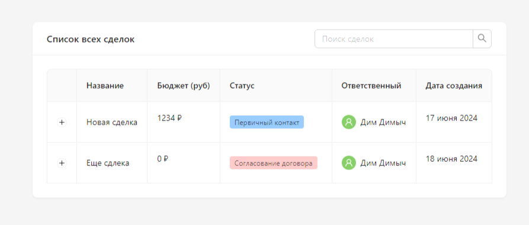
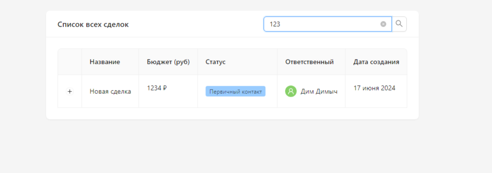

# Получение сделок из amoCRM

1. В client/.env api сервера
2. В server/.env настройка amoCRM с долгосрочным токеном

### Пример
___

<<<<<<< HEAD

=======
>>>>>>> 198a795cf8ee0b2b1ccf7e4fed02c67b69908b29
